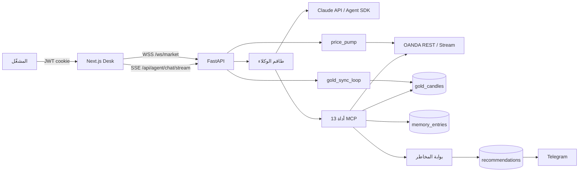
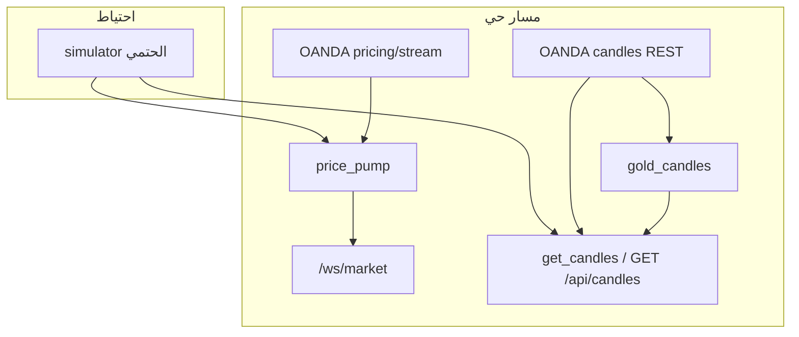
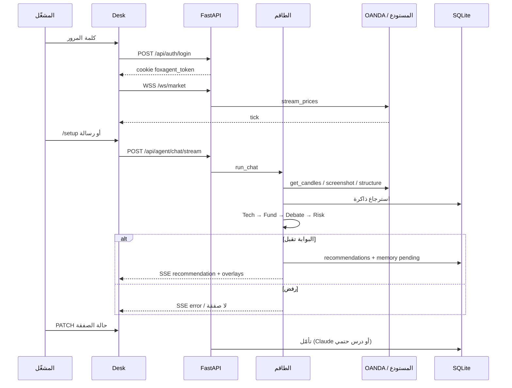
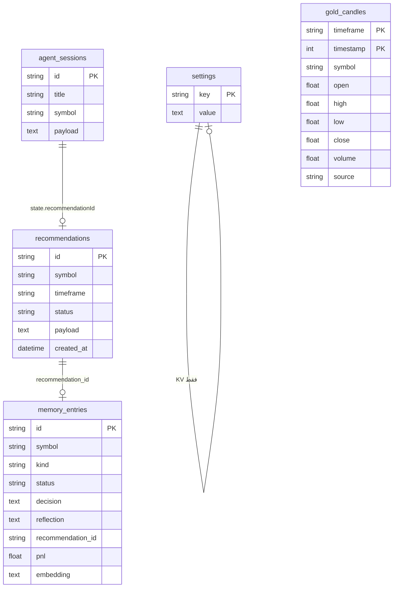

# FoxAgent — المرجع الكامل للمشروع

**محطة عمل ذكية لتوصيات التداول وفق ICT / Smart Money Concepts**

| الحقل | القيمة |
| --- | --- |
| الاسم | FoxAgent |
| الإصدار الموثَّق | `main` @ `5d9cf4e` (بعد دمج طلبات السحب 1–4) |
| النوع | محطة مشغّل واحد (single-operator workstation) |
| الواجهة الحية | `https://foxagent.lork.cloud` |
| المستودع | `github.com/loorksy/foxagent` |
| اللغة | العربية (RTL) + الإنجليزية |
| تاريخ هذا المرجع | سبتمبر 2026 |

> **إخلاء مسؤولية.** FoxAgent أداة تحليل وتوصية لمشغّل واحد. لا ينفّذ أوامر في السوق، وليس وسيطاً مرخّصاً، ولا يقدّم استشارة استثمارية منظمة. أي صفقة تبقى قراراً بشرياً.

---

## فهرس المحتويات

1. [نظرة عامة على المشروع](#1-نظرة-عامة-على-المشروع)
2. [المعمارية التقنية](#2-المعمارية-التقنية)
3. [مكونات النظام التفصيلية](#3-مكونات-النظام-التفصيلية)
4. [سير العمل والمراحل](#4-سير-العمل-والمراحل)
5. [قاعدة البيانات](#5-قاعدة-البيانات)
6. [واجهات برمجة التطبيقات](#6-واجهات-برمجة-التطبيقات-apis)
7. [واجهة المستخدم](#7-واجهة-المستخدم)
8. [الأمان والامتثال](#8-الأمان-والامتثال)
9. [الأداء والتوسع](#9-الأداء-والتوسع)
10. [الاختبار والجودة](#10-الاختبار-والجودة)
11. [النشر والتشغيل](#11-النشر-والتشغيل)
12. [خارطة الطريق](#12-خارطة-الطريق)

---

## 1. نظرة عامة على المشروع

### 1.1 الوصف والأهداف

FoxAgent محطة تداول حوارية (chat-first desk) تربط ثلاثة عوالم في شاشة واحدة:

1. **سوق حي** عبر OANDA v20 (أو محاكٍ حتمي إن لم تُضبط المفاتيح).
2. **طاقم وكلاء Claude** يحلّل الهيكل (ICT/SMC) والماكرو ويدير نقاشاً ثم بوابة مخاطر صلبة.
3. **رسم بياني تفاعلي** (klinecharts 9.8) يستقبل overlays من التوصية نفسها: FVG، Order Block، فيبوناتشي، خطوط دخول/وقف/أهداف.

الهدف التشغيلي: أن يكتب المتداول جملة طبيعية («افحص الذهب 15 دقيقة»، `/setup`، `/scan`) فيحصل على:

- سلسلة تفكير حقيقية (ليست تسميات وهمية للمراحل).
- استدعاء أدوات MCP (شموع، لقطة رؤية، تقويم جلسة، ذاكرة).
- نقاش ثنائي الجولة (Bull ثم Bear).
- توصية JSON واحدة بمدخل وحدّ وقف ومستويي هدف وR:R، أو رفض صريح من بوابة المخاطر.
- رسم الإعداد على الشارت بنقرة «أظهر على الرسم».
- تنبيه تيليجرام اختياري مع صورة الشارت.

### 1.2 المشكلة التي يحلها

| الألم الشائع | ما يفعله FoxAgent |
| --- | --- |
| تشتت الأدوات: شارت منفصل، تقويم منفصل، شات GPT منفصل | مكتب موحّد: محادثة + شارت + ذاكرة + توصيات |
| نموذج لغوي يخترع أسعار شموع | الأدوات تجلب OHLCV حقيقياً؛ الوكيل ممنوع من اختراع طبعات |
| توصية بلا ضوابط مخاطرة | `enforce_risk_gate` في الكود، لا في الـ prompt فقط |
| نسيان دروس الصفقات السابقة | دفتر `memory_entries` + استرجاع معجمي + حلقة تأمّل بعد الإغلاق |
| ذهب بلا تاريخ محلي كافٍ للتحليل متعدد الإطارات | مستودع شموع ذهب: نافذة سنتين (M15/H1/H4/D) + مزامنة 24/7 |

### 1.3 القيمة المضافة للمستخدم

- **مشغّل واحد محمي بكلمة مرور.** لا حسابات متعددة؛ الجلسة cookie `httpOnly`.
- **شفافية الطاقم.** يظهر التفكير، الأدوات، النقاش، والاستدعاءات في الواجهة لحظة حدوثها.
- **عقد توصية ثابت.** نفس JSON يغذّي قاعدة البيانات والشارت وتيليجرام.
- **إيقاف فوري.** Pause/Resume يوقف تشغيل الوكلاء ومضخّة الأسعار ومزامنة المستودع.
- **وضعان للبيانات.** `oanda` عند وجود Token + Account؛ وإلا `simulator` حتمي للتطوير والعرض.

ما **ليس** قيمة المشروع: تدريب نموذج ML محلي، تنفيذ صفقات تلقائي، تقويم اقتصادي من مزوّد ثالث، أو تحليل مشاعر أخبار بـ NLP. هذه فجوات موثّقة في القسم 12.

---

## 2. المعمارية التقنية

### 2.1 الهيكل العام (وصف + مخطط)

النظام ثلاث طبقات خلف reverse-proxy واحد (Caddy على المنفذ 18180، ثم nginx على النطاق):

```text
                    ┌─────────────────────────────────────┐
                    │  المشغّل (متصفح)                     │
                    │  Next.js 14  ·  AuthGate  ·  Zustand │
                    └──────────────┬──────────────────────┘
                                   │ HTTPS / Cookie JWT
                    ┌──────────────▼──────────────────────┐
                    │  Edge: Caddy :18180                  │
                    │  /api/*  /ws/* → backend:8000        │
                    │  *         → frontend:3000           │
                    └──────────────┬──────────────────────┘
                                   │
              ┌────────────────────┼────────────────────┐
              │                    │                    │
    ┌─────────▼─────────┐ ┌────────▼────────┐ ┌────────▼─────────┐
    │ FastAPI + uvicorn │ │ SQLite volume   │ │ Anthropic Claude │
    │ طاقم الوكلاء      │ │ foxagent.db     │ │ Messages + SDK   │
    │ MCP tools (13)    │ │ .foxagent.key   │ │ Vision (PNG)     │
    │ price_pump        │ │ gold_candles    │ └──────────────────┘
    │ gold_sync_loop    │ └────────┬────────┘
    │ reflection_loop   │          │
    └─────────┬─────────┘          │
              │                    │
              ▼                    │
    ┌───────────────────┐          │
    │ OANDA v20         │◄─────────┘  Redis pub/sub اختياري
    │ REST candles      │
    │ pricing/stream    │
    └───────────────────┘
```



مهام الخلفية عند إقلاع FastAPI (`lifespan` في `backend/app/main.py`):

| المهمة | الدور | تتوقف عند Pause؟ |
| --- | --- | --- |
| `price_pump` | بث تكات `/ws/market` من `stream_prices` أو المحاكي | نعم |
| `gold_sync_loop` | تعبئة/رتق مستودع الذهب كل ~60 ثانية | نعم |
| `_reflection_loop` | تأمّل الصفقات المغلقة كل 45 ثانية | نعم |

### 2.2 التقنيات المستخدمة

| الطبقة | التقنية | أين تظهر في المستودع |
| --- | --- | --- |
| الواجهة | Next.js 14 App Router، React 18، Tailwind، Zustand، klinecharts 9.8، mermaid | `frontend/` |
| الخادم | FastAPI، Uvicorn، Pydantic v2، httpx، SQLAlchemy 2 async | `backend/app/` |
| الذكاء | Anthropic Messages API + `claude-agent-sdk` + رؤية PNG عبر matplotlib | `crew.py`, `sdk_runtime.py`, `chart_capture.py` |
| السوق | OANDA v20 REST + streaming socket؛ محاكٍ محلي | `oanda.py`, `simulator.py` |
| البيانات | SQLite (`aiosqlite`) افتراضياً؛ Postgres (`asyncpg`) اختياري | `db.py`, `DATABASE_URL` |
| الحافلة | pub/sub داخل العملية + Redis اختياري | `bus.py` |
| الحافة | Caddy 2.8 داخل Compose؛ nginx على المضيف للنطاق | `deploy/` |
| الاختبار | pytest + pytest-asyncio (100 اختبار خلفية على `main`)؛ Vitest (3) | `backend/tests/`, `frontend/**/*.test.tsx` |

### 2.3 لماذا هذه التقنيات تحديداً

| اختيار | السبب في سياق FoxAgent |
| --- | --- |
| **FastAPI + async** | بث SSE للطاقم، WebSocket للتكات، وثلاث حلقات خلفية دون خيوط ثقيلة |
| **Claude وليس نموذجاً محلياً** | التحليل نوعي (ICT + سياق ماكرو) ويتطلّب tool-use وبثاً للتفكير؛ لا يوجد بديل محلي يختلق إعداداً إن غاب المفتاح |
| **MCP / Agent SDK** | نفس الأدوات تُستدعى من مسار SDK أو من Anthropic tool-use؛ العدادات تظهر في `/api/health` |
| **klinecharts 9.8** | overlays برمجية (`rect`, `trendLine`, `fibonacci`…) تطابق عقد `KlineOverlay` |
| **SQLite على الحجم** | مشغّل واحد، نسخ احتياطي بملف واحد، لا حاجة لعقدة DB في الإنتاج الحالي |
| **Fernet للأسعار** | مفاتيح Anthropic/OANDA/Telegram لا تُخزَّن نصاً واضحاً في `settings` |
| **Caddy داخل Compose** | عزل المنفذ 18180 عن بقية خدمات الـ VPS؛ nginx الخارجي ينهي TLS فقط |

---

## 3. مكونات النظام التفصيلية

### أ. محرك الذكاء الاصطناعي

#### نوع النماذج

| المكوّن | النوع | تدريب محلي؟ |
| --- | --- | --- |
| Claude Sonnet 4.5 (افتراضي) / 3.7 / 3.5 / Haiku / Opus 4.5 | LLM مستضاف لدى Anthropic | لا — استدلال فقط بمفتاح المشغّل |
| ماسح ICT في `analysis.py` | قواعد حتمية على OHLCV | لا — خوارزمية وليست شبكة عصبية |
| ذاكرة القرارات | تضمين معجمي (TF للرموز × جيب تمام) | لا — ليست embeddings عصبية |
| عاكس ما بعد الصفقة | Claude قصير أو درس حتمي إن غاب المفتاح | لا |

**لا يوجد في المشروع تدريب نماذج، ولا fine-tuning، ولا مجموعة بيانات معلّمة للصفقات.** جودة التوصية تعتمد على: جودة الشموع، جودة الـ prompt، وصرامة بوابة المخاطر.

النماذج المعروضة في `GET /api/models`:

| المعرّف | الشارة في الواجهة |
| --- | --- |
| `claude-sonnet-4-5` | Default |
| `claude-3-7-sonnet-latest` | Vision |
| `claude-3-5-sonnet-latest` | Stable |
| `claude-3-5-haiku-latest` | Fast |
| `claude-opus-4-5` | Max |

اختصارات الشات (`/model sonnet`, `haiku`, `opus`) تُحل في `MODEL_ALIASES` داخل `agent.py`.

#### مسار التنفيذ (مساران، نفس العقد)

```text
run_chat
  └─ run_crew
       ├─ استرجاع ذاكرة المعجم
       ├─ TechnicalAgent     ──┐
       ├─ FundamentalAgent   ──┤  run_agent_turn
       ├─ Bull ×2 + Bear ×2  ──┤  سقف: جولتان أو 90 ثانية
       └─ RiskManagerAgent   ──┘
              │
              ├─ حاول Claude Agent SDK (mcp__oanda__*)
              └─ إن فشل: Anthropic messages.create + tools=mcp_tool_specs()
```

`run_agent_turn` يجرّب SDK أولاً (`_try_sdk_turn`). إن نجح يُحتسب في `sdk_runtime.stats`. إن فشل يسقط بهدوء إلى Anthropic tool-use حتى 8 جولات أداة، مع `thinking` إن دعمه النموذج.

#### مصادر البيانات التي يراها الوكيل

الأدوات الثلاث عشرة المسجّلة في `mcp_tools.py`:

| # | الأداة | المصدر الفعلي |
| --- | --- | --- |
| 1 | `get_candles` | مستودع الذهب إن انطبق، وإلا OANDA REST أو المحاكي |
| 2 | `get_live_price` | تسعير OANDA أو `simulator.tick` |
| 3 | `capture_chart_screenshot` | matplotlib → PNG base64 → رؤية Claude |
| 4 | `structure_scan` | `analyze_structure` على الشموع |
| 5 | `calculate_ict_levels` | نفس الماسح + مستويات فيبو |
| 6 | `query_technical_memory` | `get_past_context` |
| 7 | `query_macro_memory` | نفس الدفتر باستعلام ماكرو |
| 8 | `get_economic_calendar` | ساعة جلسات UTC — **ليس** تقويماً اقتصادياً خارجياً |
| 9 | `get_market_sentiment` | تحيّز هيكلي H1 + السعر الحي |
| 10 | `fetch_financial_news` | RSS رويترز للأعمال (8 عناوين) |
| 11 | `validate_risk_rules` | معاينة فقط؛ لا يحفظ |
| 12 | `send_recommendation` | يستدعي `persist_recommendation` → البوابة ثم SQLite |
| 13 | `record_post_trade_reflection` | يكتب درساً في `memory_entries` |

#### خوارزميات التحليل والتوصية

1. **ماسح هيكلي حتمي** (`analyze_structure`):
   - فراكتال 3 يمين/يسار لاستخراج Swing High/Low.
   - FVG: فجوة بين شمعة i-2 و i.
   - Order Block: آخر شمعة معاكسة قبل الـ swing.
   - BOS: إغلاق فوق آخر قمة أو تحت آخر قاع.
   - كنس سيولة الجلسة الآسيوية (00:00–07:00 UTC).
   - فيبوناتشي على آخر swing صاعد/هابط.
2. **طاقم نوعي**: الـ LLM يركّب رواية ICT متعددة الإطارات (D/H4 ثم H1/M15 ثم M5/M1 في التعليمات) ويلتقط لقطة للشارت.
3. **نقاش**: الثور يبني القضية؛ الدب يهاجم FVG غير المُخفَّف ومخاطر الجلسة والتقويم.
4. **الحكم**: RiskManager إما يستدعي `send_recommendation` أو يرفض. حتى لو أرسل JSON، **الكود** يعيد فرض R:R والجلسة ونسبة المخاطرة.

دالة `build_recommendation` في `analysis.py` تبني إعداداً خوارزمياً (دخول عند توازن FVG/OB، وقف ATR، أهداف 1.6R و 3R). مسار الإنتاج للمشغّل هو الطاقم + البوابة، لا هذه الدالة وحدها؛ الدالة تخدم الاختبارات والسيناريوهات الحتمية.

---

### ب. جمع البيانات

#### مصادر السوق



| القناة | البروتوكول | الاستخدام |
| --- | --- | --- |
| شموع | `GET /v3/instruments/{ins}/candles` | الرسم، الماسح، المستودع، أدوات الوكيل |
| تكات | `GET …/pricing/stream` (SSE من جانب OANDA) | الشارت الحي عندما `oanda_configured` |
| تسعير REST | `GET …/pricing` | `GET /api/prices` احتياط إن انقطع الـ WS |
| محاكٍ | بذرة هاش + تقلّب الجلسة | تطوير وعروض بلا مفاتيح |

الأزواج المدعومة في `INSTRUMENT_SPECS`:

`XAU_USD`, `EUR_USD`, `GBP_USD`, `GBP_JPY`, `USD_JPY`, `AUD_USD`, `USD_CAD`, `EUR_JPY`, `NZD_USD`, `USD_CHF`.

المستودع الذهبي **ذهب فقط**. بقية الأزواج تبقى على المسار الحي/المحاكي دون تخزين سنتين.

#### أنواع البيانات

| النوع | المحتوى | المصدر |
| --- | --- | --- |
| أسعار | bid / ask / mid / spread / time / source | تيار أو REST أو محاكٍ |
| شموع | OHLCV + `complete` + timestamp ملّي ثانية | OANDA mid (`price=M`) |
| أخبار | عنوان + رابط | Reuters business RSS |
| مؤشرات هيكلية | bias, BOS, FVG, OB, sweep, confluence | حساب محلي |
| جلسة | asian / london / london_ny_overlap / ny / late_ny_asia | ساعة UTC |
| أسرار التشغيل | مفاتيح ونِسَب مخاطرة | Fernet في صف `settings` |

**لا تُجلب مؤشرات تقليدية جاهزة من مزوّد** (لا RSI/MACD من API). الواجهة ترسم MA / VOL / MACD محلياً على klinecharts. التحليل «الرسمي» للوكيل هو ICT لا حزمة مؤشرات كلاسيكية.

#### المعالجة والتنظيف

- زمن OANDA يُحوَّل إلى UTC واعٍ للكسور (`_parse_oanda_time`).
- المستودع يخزّن الشموع **المكتملة فقط** (`complete is not False`).
- الدفعات 5000 شمعة، تأخير 0.4 ث، وإعادة محاولة أسّية عند 429.
- القص على أقدم من 730 يوماً (`prune_older_than`).
- فجوات نهاية الأسبوع تُوسَم `weekend` ولا تُعاد تعبئتها كأنها انقطاع.
- إن فشل REST تُستخدم شموع المحاكي مع تحذير في السجل — حتى لا تُكسر الواجهة.

---

### ج. نظام التحليل

#### التحليل الفني (TechnicalAgent + الماسح)

إلزام التعليمات في `SYSTEM_PROMPT`:

1. الإطار العالي D / H4: الاتجاه، مجمعات السيولة، MSS، Order Blocks.
2. الإطار المتوسط H1 / M15: BOS، FVG، توازن النطاق، فيبو 0.5 / 0.618 / 0.786.
3. الإطار المنخفض M5 / M1: الزناد، كنس السيولة، شمعة التأكيد.
4. مرور مزدوج: أدوات رقمية ثم `capture_chart_screenshot` (كتف-رأس، خطوط، كسر كاذب).

الماسح يضيف نقاط التقاء نصية مثل:

- `Market structure shift: BULLISH BOS`
- `Liquidity sweep: Buy Side Reclaim Asian Low`
- `Bullish FVG still unfilled`

أمر `/scan` في الواجهة يستدعي `GET /api/structure` فقط — **بدون** تشغيل الطاقم — ويرسم FVGs غير المملوءة.

#### التحليل الأساسي (FundamentalAgent)

يركّز على:

- ساعة الجلسة UTC.
- سياق معدلات/مخاطرة عامة إن ظهر في الأخبار.
- خطر التقويم — مع التصريح إن المصدر فارغ.

`get_economic_calendar` يعيد نوافذ الجلسات فقط وملاحظة صريحة: *لا يوجد تقويم طرف ثالث مضبوط*. الوكيل مأمور ألا يخترع طبعات اقتصادية.

#### تحليل المشاعر

`get_market_sentiment` **ليس** نموذج NLP على العناوين. هو:

- تحيّز `analyze_structure` على 120 شمعة H1.
- آخر BOS وكنس السيولة ونقاط التقاء.
- mid/spread الحي ومصدره (`oanda` أو `simulator`).
- الجلسة الحالية.

عناوين رويترز تُمرَّر خاماً إلى FundamentalAgent ليقرأها كنص.

#### مؤشرات التداول المستخدمة

| المؤشر / المفهوم | أين يُحسب | يظهر للوكيل؟ | يظهر على الشارت؟ |
| --- | --- | --- | --- |
| FVG | `analysis._detect_fvgs` | نعم | overlay `rect` |
| Order Block | `_detect_order_blocks` | نعم | `rect` |
| BOS / تحيّز | مقارنة الإغلاق بالـ swings | نعم | نص التقاء |
| فيبوناتشي ICT | آخر swing | نعم | overlay `fibonacci` |
| نطاق آسيا | ساعات 0–7 UTC | نعم | مستويات |
| ATR تقريبي | متوسط المدى لـ 14 شمعة في `build_recommendation` | مسار خوارزمي | لا كمؤشر مستقل |
| MA / VOL / MACD | klinecharts محلي | لا | نعم للمشغّل |

---

### د. نظام التوصيات

#### توليد التوصية

عقد الإخراج الإلزامي (ملخّص من `SYSTEM_PROMPT`):

```json
{
  "id": "rec_a1b2c3d4e5f6",
  "timestamp": "2026-09-08T21:00:00+00:00",
  "symbol": "XAU_USD",
  "timeframe": "15m",
  "sentiment": "BULLISH",
  "tradeSetup": {
    "action": "BUY",
    "orderType": "LIMIT",
    "entryPrice": 2650.4,
    "stopLoss": 2642.1,
    "takeProfitLevels": [
      { "level": 1, "price": 2663.7, "ratio": "1:1.6" },
      { "level": 2, "price": 2675.3, "ratio": "1:3.0" }
    ],
    "riskRewardRatio": 3.0
  },
  "rationale": "شرح المعلّم…",
  "confluence": ["Bullish FVG still unfilled"],
  "klineOverlays": [],
  "focusTimestamp": 1725148800000
}
```

الطوابع الزمنية في overlays **يجب** أن تكون timestamps شموع حقيقية بالملّي ثانية.

الحفظ يتم فقط عبر `persist_recommendation`:

```python
# mcp_tools.persist_recommendation
rec = TradeRecommendation.model_validate(payload)
await enforce_risk_gate(dumped)   # يرفع RiskRejected إن فشل
await save_recommendation(rec)
schedule_trade_alert(rec)        # تيليجرام في الخلفية
await emit("recommendation", dumped)
```

#### نظام التقييم والثقة

لا توجد درجة ثقة رقمية (0–100) في المخطط. بدائل الثقة في المنتج:

| الإشارة | المعنى |
| --- | --- |
| `sentiment` | BULLISH / BEARISH / NEUTRAL |
| `confluence[]` | قائمة أسباب هيكلية |
| `riskRewardRatio` | يجب ≥ `minRiskReward` (افتراضي 2.0) |
| رفض البوابة | الأسباب تُبثّ حدث `error` مع `gate.reasons` |
| رفض RiskManager بدون JSON | `AgentUnavailable` — لا توصية مخترَعة |
| `visionNotes` | ملاحظات بصرية اختيارية بعد اللقطة |

#### إدارة المخاطر

ثلاثة أقفال في `risk_rules.py` (القيم من الإعدادات المشفّرة):

| القفل | الحساب | الافتراضي |
| --- | --- | --- |
| الحد الأدنى R:R | `riskRewardRatio` أو يُشتق من آخر TP | 2.0 |
| الجلسة مسموحة | ساعة UTC مقابل `allowedSessions` | london, ny, asian |
| سقف المخاطرة الضمنية | `riskPercent` صريح أو `|entry−SL|/entry × 100` | 1.0% |

تداخل لندن/نيويورك يُقبل إن وُجدت `london` أو `ny`. Pause العالمي (`system_paused`) يمنع بدء تشغيل جديد ويثلّج المضخّة والمستودع.

**لا يوجد تحديد حجم اللوت أو ربط بحساب وساطة للتنفيذ.** المخاطرة هنا هندسية على السعر لا على رصيد الحساب.

#### توقيت التوصيات

- **يدوي:** المشغّل يرسل رسالة أو `/setup`.
- **لا يوجد كرون** يطلق الطاقم كل N دقائق.
- الجلسة تُفحص لحظة الحفظ لا لحظة الفكرة.
- بعد الحفظ تُرسل تيليجرام فوراً (مع إعادة محاولة).
- تحديث الحالة (`PENDING` → `HIT_TP2` / `STOPPED_OUT`…) يدوي من الواجهة أو عبر `PATCH`؛ حلقة التأمّل تلتقط الحالات الطرفية كل 45 ثانية.

---

## 4. سير العمل والمراحل



### مرحلة جمع البيانات

1. عند الإقلاع: `gold_sync_loop` ينتظر 4 ثوانٍ ثم يعبّئ M15→H1→H4→D من بداية نافذة السنتين، مستأنفاً من آخر شمعة مخزّنة.
2. `price_pump` يفتح تيار OANDA لكل الأدوات أو يولّد تكات محاكية كل 250ms.
3. طلبات الرسم `GET /api/candles` تقرأ المستودع أولاً للذهب على الإطارات الأربعة.

### مرحلة المعالجة والتحليل

1. ضمان الجلسة (`ensure_session`) ورفض إن كان النظام متوقفاً.
2. بث `run_start` ثم حفظ رسالة المستخدم في `agent_sessions.state.messages`.
3. TechnicalAgent يجمع شموعاً ولقطة ومسحاً.
4. FundamentalAgent يقرأ الجلسة والأخبار والذاكرة الكلية.
5. نقاش بسقف `DebateBudget(2, 90s)`.

### مرحلة توليد التوصيات

1. RiskManager يقرّر.
2. `TradeRecommendation.model_validate` يفرض الشكل.
3. `enforce_risk_gate` قد يرفض بعد موافقة النموذج.
4. البث للواجهة + بطاقة التوصية + تطبيق overlays اختياري.

### مرحلة التنفيذ والمتابعة

**التنفيذ اليدوي فقط.** المشغّل ينسخ الأسعار أو ينظر إلى الشارت ويضع الأمر عند وسيطه.

المتابعة داخل FoxAgent:

- صفحة التوصيات مع R:R والحالة.
- `markFromPrice` يحدّث الحالة تقريباً من التكات الحية (ربح/وقف) على العميل.
- `PATCH /api/recommendations/{id}` للحالة النهائية وPnL.
- تيليجرام عند الإنشاء (وليس عند كل تغيير حالة ما لم يُرسل يدوياً).

### دورة التعلّم المستمر

```text
store_decision (pending)
        │
        ▼
  صفقة تُغلق (HIT_TP* / STOPPED_OUT / EXPIRED / CANCELLED)
        │
        ▼
write_reflection → Claude 2–4 جمل أو deterministic_lesson
        │
        ▼
update_with_outcome (resolved + embedding جديد)
        │
        ▼
التشغيل التالي: get_past_context(symbol, query)
        (جيب تمام معجمي، نفس الرمز أولاً ثم عبر الرموز)
```

هذا «تعلّم» تشغيلي (دفتر دروس) لا إعادة تدريب أوزان.

---

## 5. قاعدة البيانات

المحرك الافتراضي: `sqlite+aiosqlite:////data/foxagent.db`.  
البديل: `postgresql+asyncpg://…`.  
إن فشل الاتصال يسقط النظام إلى مخازن ذاكرة للعملية (مناسب للاختبار فقط).

`init_db` يستورد النماذج الجانبية ثم `Base.metadata.create_all` — لا توجد مكتبة ترحيل Alembic؛ الجداول تُنشأ إن نقصت.

### 5.1 المخطط العلائقي



### 5.2 الجداول

#### `recommendations`

| العمود | النوع | الدور |
| --- | --- | --- |
| `id` | VARCHAR(64) PK | مثل `rec_` + 12 hex |
| `symbol` | VARCHAR(32) مفهرس | `XAU_USD` |
| `timeframe` | VARCHAR(16) | `15m` / `M15` |
| `status` | VARCHAR(24) مفهرس | انظر التعداد أدناه |
| `payload` | TEXT | JSON كامل لـ `TradeRecommendation` |
| `created_at` | DateTime TZ مفهرس | |

حالات `RecommendationStatus`:  
`PENDING`, `ACTIVE`, `IN_PROFIT`, `HIT_TP1`, `HIT_TP2`, `STOPPED_OUT`, `EXPIRED`, `CANCELLED`.

#### `memory_entries`

| العمود | الدور |
| --- | --- |
| `kind` | `technical` / `macro` / `risk` |
| `status` | `pending` / `resolved` |
| `embedding` | JSON لتردد الرموز المعياري |
| `recommendation_id` | ربط اختياري بالتوصية |

#### `agent_sessions`

`payload` JSON فيه:

```json
{
  "messages": [],
  "thoughts": [],
  "tools": [],
  "debate": [],
  "artifacts": [],
  "overlays": [],
  "recalls": [],
  "recommendationId": null
}
```

المعرّف UUID (أو `bc-` + UUID). أحداث التفكير/الأدوات/النقاش **سلطة الخادم** عبر `append_session_event` حتى لا يمسح عميل متأخر النصّ من سباق PUT.

#### `settings`

مخزن مفتاح/قيمة. المفتاح التشغيلي: `runtime_settings` (قيمة Fernet).  
مفتاح التحكم: `system_paused` = `1` / `0`.

#### `gold_candles`

مفتاح مركّب `(timeframe, timestamp)`. تقدير الحجم: ~66 ألف صف / ~14 MiB لسنتين تداول على أربعة إطارات.

### 5.3 البيانات التاريخية

| ماذا | أين | الاحتفاظ |
| --- | --- | --- |
| شموع الذهب | `gold_candles` | 730 يوماً، قص دوري |
| شموع الأزواج الأخرى | غير مخزّنة | تُجلب عند الطلب |
| التوصيات | `recommendations.payload` | بلا TTL |
| الدروس | `memory_entries` | بلا TTL |
| جلسات الشات | `agent_sessions` | بلا TTL (حد القائمة 80) |

### 5.4 المستخدمون

**لا جدول مستخدمين.** المشغّل كيان واحد:

- كلمة المرور من `APP_PASSWORD` أو `ADMIN_PASSWORD_HASH` (bcrypt) في بيئة الحاوية.
- JWT `sub=operator`، صلاحية افتراضية 720 دقيقة.
- لا أدوار، لا عزل بيانات بين أشخاص.

---

## 6. واجهات برمجة التطبيقات (APIs)

كل مسار تحت `/api/*` باستثناء تسجيل الدخول/الخروج يتطلب JWT (كوكي أو `Authorization: Bearer` أو `?token=`).  
`/ws/market` يغلق بـ 1008 إن غاب الرمز.

لا يوجد **Rate Limiting** على واجهة FoxAgent نفسها. الحد الوحيد المبرمج هوBackoff مستودع الذهب أمام OANDA (6 محاولات، تضاعف التأخير عند 429).

### 6.1 المصادقة

| الطريقة | المسار | الجسم | الرد |
| --- | --- | --- | --- |
| POST | `/api/auth/login` | `{"password":"…"}` | `{"ok":true,"operator":true}` + Set-Cookie `foxagent_token` |
| POST | `/api/auth/logout` | — | `{"ok":true}` ويمسح الكوكي |
| GET | `/api/auth/me` | — | `{"ok":true,"operator":true}` أو 401 |

كوكي: `HttpOnly`, `SameSite=Lax`, `Path=/`, بدون `Secure` في الكود (الـ TLS ينتهي عند nginx).

### 6.2 الصحة والنظام

| الطريقة | المسار | ملاحظات |
| --- | --- | --- |
| GET | `/api/health` | `dataMode`, جاهزية Anthropic (فحص حي مُخزَّن ~120ث)، لقطات SDK، `goldWarehouse` |
| GET | `/api/system/status` | `{paused}` |
| POST | `/api/system/pause` | يوقف الطاقم والمضخّة والمستودع |
| POST | `/api/system/resume` | |
| GET | `/api/warehouse/gaps` | تقرير فجوات المستودع |

مثال رد صحة (مختصر):

```json
{
  "ok": true,
  "service": "FoxAgent",
  "dataMode": "oanda",
  "anthropicReady": true,
  "goldWarehouse": {
    "symbol": "XAU_USD",
    "retentionDays": 730,
    "timeframes": {
      "M15": { "count": 47178, "latestTime": "2026-08-28T20:45:00+00:00", "stale": true }
    }
  }
}
```

### 6.3 السوق

| الطريقة | المسار | مثال |
| --- | --- | --- |
| GET | `/api/instruments` | كتالوج العشرة أزواج |
| GET | `/api/candles?instrument=XAU_USD&granularity=M15&count=300` | شموع kline |
| GET | `/api/prices` | لقطة REST لكل الأدوات |
| GET | `/api/structure?instrument=XAU_USD&granularity=M15` | ملخص ICT |
| WS | `/ws/market` | `{"type":"tick","payload":{…LivePrice}}` |

### 6.4 الوكيل والجلسات

| الطريقة | المسار | الدور |
| --- | --- | --- |
| POST | `/api/agent/chat` | تشغيل متزامن (للاختبار/العملاء البسطاء) |
| POST | `/api/agent/chat/stream` | **المسار الإنتاجي** — SSE |
| POST | `/api/agent/chat/stream/cancel` | `{"runId":"run_…"}` |
| CRUD | `/api/sessions` | إنشاء/قراءة/تحديث/حذف |

أحداث SSE الشائعة:

| `type` | المعنى |
| --- | --- |
| `run_start` | `runId` + `sessionId` |
| `agent_thought` | دلتا تفكير أو نص (بعد تجريد artifacts) |
| `agent_tool_call` / `agent_tool_result` | أداة MCP |
| `agent_debate_message` | `role: bull|bear` + `round` |
| `agent_memory_recall` | دروس مسترجَعة |
| `recommendation` / `agent_recommendation` | JSON التوصية |
| `error` | يشمل `paused` أو `gate` |
| `cancelled` / `run_complete` | نهاية التشغيل |

إغلاق متصفح لـ SSE يستدعي `request_cancel` في `finally` حتى لا يبقى الطاقم يستهلك الرصيد.

### 6.5 التوصيات والذاكرة والإعدادات

| الطريقة | المسار |
| --- | --- |
| GET | `/api/recommendations` |
| PATCH | `/api/recommendations/{id}` |
| GET | `/api/memory` ، `/api/memory/context` |
| GET/PUT | `/api/settings` |
| POST | `/api/settings/validate` `target=anthropic|oanda|telegram` |
| GET | `/api/models` |

`GET /api/settings` يعيد `SettingsPublic` (المفاتيح مقنّعة: هل وُضعت أم لا) دون تسريب السر.

---

## 7. واجهة المستخدم

التطبيق عربي/إنجليزي (`frontend/src/i18n`) مع RTL افتراضي للعربية. التخطيط: شريط جانبي + شات + لوح شارت/Artifacts.

### 7.1 لوحة التحكم الرئيسية (`/agents`, `/agents/[sessionId]`)

- قائمة محادثات (إنشاء/حذف/عنوان).
- ملحن أوامر مع اختصارات: `/scan`, `/setup`, `/timeframe 15m`, `/model sonnet`, `/pair xauusd`, `/overlay clear`.
- بث التفكير (`ChatThinking`) والأدوات والنقاش.
- مساحة Artifacts (Markdown / CSV / Mermaid / كود) — تُخفى إن لم يوجد أثر.
- أعلى الشاشة: الزوج، الإطار، النموذج، وضع البيانات (`oanda`/`simulator`)، زر تحديث الشارت، إيقاف التشغيل.

### 7.2 عرض التوصيات

- بطاقة داخل الشات (`RecommendationCard`): اتجاه، دخول، وقف، TP1/TP2، R:R، نسخ الأسعار، «أظهر على الرسم».
- صفحة `/recommendations`: قائمة الحالة والـ confluence.

### 7.3 الرسوم البيانية

`ChartCanvas` (تحميل ديناميكي بلا SSR):

- شموع من `/api/candles`.
- تكات من `/ws/market` تحدّث الشمعة الجارية عبر `workspace.prices`.
- مؤشرات MA/VOL/MACD.
- overlays من التوصية أو من `/scan`.
- `focusTimestamp` لإعادة التمركز على الإعداد.

المستودع **لا** يرسم الشمعة الجارية؛ التشكيل الحي من التيار فقط.

### 7.4 الإعدادات (`/settings`)

- Anthropic / OANDA (practice|live) / Telegram.
- `maxRiskPercent`, `minRiskReward`, الجلسات المسموحة.
- تحقق حي للمفتاح (`validate`).
- **Pause agent / Resume** — مفتاح القتل.
- الأسرار لا تُعاد إلى الحقول؛ الحفظ يدمج القيم الجديدة مع المخزَّن.

### 7.5 التنبيهات

| القناة | السلوك |
| --- | --- |
| تيليجرام | HTML + صورة شارت عند حفظ توصية؛ يفشل مغلقاً إن نُقص التوكن |
| الواجهة | أحداث SSE فورية |
| لا يوجد | بريد، دفع متصفح، SMS |

`AuthGate`: أي 401 على `/api/auth/me` يعيد التوجيه إلى `/login?next=…`.

---

## 8. الأمان والامتثال

### 8.1 التشفير وحماية الأسرار

| الأصل | الحماية |
| --- | --- |
| مفاتيح API في DB | Fernet؛ المفتاح في `/data/.foxagent.key` (وضع 600) أو `SETTINGS_SECRET` |
| كلمة المشغّل | bcrypt إن وُجد الهاش؛ وإلا مقارنة HMAC لـ `APP_PASSWORD` (لا تُكتب في DB) |
| JWT | HS256؛ سر `JWT_SECRET` |
| أخطاء Claude | تُنقَّى من المفتاح قبل البث (`_sanitize_error`) |
| رد الإعدادات | أقنعة `••••` ورايات `*Set` |

تحذير تشغيلي: **لا تضبط `SETTINGS_SECRET` على خادم يملك مسبقاً `.foxagent.key`** — فك التشفير سيفشل وتُفقد الإعدادات المخزّنة.

### 8.2 سطح المصادقة

- وسطاء FastAPI يصدّان كل `/api/*` عدا login/logout.
- الشارت والذاكرة والإعدادات داخل مجموعة `(desk)` خلف `AuthGate`.
- WebSocket يرفض بلا رمز.
- مشغّل واحد: سرقة الكوكي = السيطرة الكاملة على المكتب.

### 8.3 الامتثال التنظيمي

| الموضوع | موقف المشروع |
| --- | --- |
| ترخيص وساطة / إدارة محافظ | غير حاصل وغير مدّعى |
| تنفيذ أوامر | غير موجود |
| بيانات شخصية لعدّة عملاء | غير موجودة (مشغّل واحد) |
| MiFID / KYC / سجل أوامر منظّم | خارج النطاق |
| إخلاء | التحليل تعليمي/تشغيلي للمشغّل |

إن وُضع الحساب على `oandaEnvironment=live` فذلك حساب المشغّل لدى OANDA؛ FoxAgent ما زال **لا يرسل أوامر**.

### 8.4 سجلات التدقيق

لا توجد طاولة `audit_log`. ما يتوفر عملياً:

- سجلات الحاوية (uvicorn + httpx + gold_sync).
- دفتر `memory_entries` (قرار + نتيجة + درس).
- `recommendations` بتاريخ وحالة.
- `agent_sessions.state` كنص تشغيل (تفكير/أدوات/نقاش).

هذا أثر تشغيلي لا أثر امتثال قانوني.

---

## 9. الأداء والتوسع

### 9.1 الزمن الحقيقي

| المسار | الآلية | الكمون النموذجي |
| --- | --- | --- |
| سعر الشارت | تيار OANDA → بث WS | دون الثانية أثناء الجلسة |
| الشموع | قراءة المستودع أو REST | عشرات–مئات الملّي للمستودع |
| تشغيل الطاقم | عدة نداءات Claude + أدوات | عشرات الثواني إلى دقائق |
| تعبئة الذهب الأولى | ~66 ألف صف على دفعات 5k | نحو 10–20 دقيقة على شبكة حية |

السوق المغلق (عطلة نهاية الأسبوع) يبقي التيار مفتوحاً (200 + نبضات) بلا أحداث `PRICE` — وهذا متوقع وليس سقوطاً إلى المحاكي.

### 9.2 التخزين المؤقت

| ماذا | المدة / المكان |
| --- | --- |
| فحص Anthropic | 120 ثانية في الذاكرة (`_PROBE_TTL_SEC`) |
| شموع الذهب | SQLite المستودع |
| صفحات Next الثابتة | `s-maxage` عبر CDN/النطاق |
| لا يوجد | Redis cache لـ REST العام |

Redis إن ضُبط فهو **حافلة أحداث** (`foxagent:{topic}`) لا كاش استعلام.

### 9.3 موازنة التحميل وقابلية التوسع

التصميم الحالي **عملية خلفية واحدة**:

- `price_pump` وHub الـ WS داخل نفس العملية.
- إلغاء التشغيل مجموعة في الذاكرة (`_cancelled`).
- Pause يُكتب في SQLite حتى يبقى بعد إعادة التشغيل.

أفقيًا يلزم: Redis إلزامي للحافلة، تخزين إلغاء موزّع، وملحق مشترك لـ SQLite/Postgres، وفصل مستودع الذهب عن مسار الطلب. هذا غير مُنفَّذ — والمستهدف مشغّل واحد.

---

## 10. الاختبار والجودة

### 10.1 الاستراتيجية

| الطبقة | الأداة | العدد على `main` | ملاحظات |
| --- | --- | --- | --- |
| خلفية | pytest + pytest-asyncio | **100** نجح، 0 تخطٍ | `GOLD_WAREHOUSE_SYNC=0` في `conftest` حتى لا تشتغل المزامنة أثناء الاختبار |
| واجهة | Vitest | **3** | TopBar (إخفاء Artifacts الفارغ) + ArtifactsWorkspace |
| CI GitHub | موجود في النية | غير متاح حالياً (فوترة) | لا تنتظر الشارة الخضراء |

ملفات الاختبار الرئيسية:

| الملف | ماذا يغطي |
| --- | --- |
| `test_auth.py` | كوكي، 401، login |
| `test_risk_gate.py` | R:R / جلسة / نسبة |
| `test_debate.py` | جولتان + سقف زمني |
| `test_cancel.py` / `test_kill_switch.py` | إلغاء وPause |
| `test_session_race.py` | عدم مسح النص بـ PUT قديم |
| `test_analysis.py` | FVG / BOS / overlays |
| `test_memory_reflection.py` | استرجاع + درس |
| `test_sdk_path.py` / `test_vision_and_draw.py` | مسار SDK والرؤية |
| `test_candle_warehouse.py` | تعبئة/رتق/قص |
| `test_live_stream.py` | وصول تكات التيار إلى WS |
| `test_telegram.py` | فشل مغلق بلا أسرار |

تشغيل:

```bash
cd backend && GOLD_WAREHOUSE_SYNC=0 PYTHONPATH=. pytest -q
cd frontend && npx vitest run
```

### 10.2 دقة التوصيات

لا توجد مجموعة تسميات «صفقة صحيحة». الدقة تُقاس بـ:

- رفض البوابة عندما R:R < الحد.
- عدم الحفظ إن غاب المفتاح.
- تطابق overlay timestamps مع شموع حقيقية (اختبارات التحليل).
- دفتر الدروس بعد الإغلاق — جودة نوعية يراجعها المشغّل.

### 10.3 Backtesting

**لا محرّك باك تست في المستودع.** مستودع السنتين يوفّر المادة الخام (إعادة تشغيل الماسح على تاريخ الذهب) لكنه لا يحاكي تنفيذ أوامر ولا ينتج منحنى حقوق. أي باك تست اليوم سكربت خارجي على `gold_candles`.

### 10.4 مراقبة الأداء

- `/api/health` + `goldWarehouse.timeframes.*.stale`.
- عدّادات SDK في الصحة.
- سجلات `Backfilled TF: N/M candles`.
- لا Prometheus/Grafana مضمّنان.

---

## 11. النشر والتشغيل

### 11.1 بيئة الإنتاج الحالية

| العنصر | القيمة |
| --- | --- |
| المضيف | VPS (`foxagent-vps`) |
| المسار | `/opt/foxagent` |
| المشروع | `docker compose -p foxagent` **إلزامي** (لا `down` عارٍ) |
| الحجم | `foxagent_data` → `/data/foxagent.db` + `.foxagent.key` |
| المنفذ الداخلي | 18180 |
| النطاق | `foxagent.lork.cloud` عبر nginx → 127.0.0.1:18180 |
| الأسرار | `/opt/foxagent/deploy/.env` وضع 600؛ OANDA/Anthropic داخل DB بعد أول حفظ |

### 11.2 الحاويات

`deploy/docker-compose.yml`:

| الخدمة | الصورة | الدور |
| --- | --- | --- |
| `backend` | `deploy/Dockerfile.backend` (Python 3.12) | uvicorn `app.main:app` |
| `frontend` | `deploy/Dockerfile.frontend` (Node 20، `next build`) | أصل الواجهة |
| `edge` | `caddy:2.8-alpine` | توجيه `/api` و`/ws` وباقي المسارات |

Caddy:

```caddy
:18180 {
  handle /api/* { reverse_proxy backend:8000 }
  handle /ws/*  { reverse_proxy backend:8000 }
  handle        { reverse_proxy frontend:3000 }
}
```

### 11.3 إجراء نشر آمن (ملخّص تشغيلي)

1. نسخة احتياطية: `sqlite3 foxagent.db ".backup …"` + نسخ `.foxagent.key`.
2. `git pull --ff-only` على `/opt/foxagent`.
3. `cd deploy && docker compose -p foxagent up -d --build`.
4. تحقق: `/api/health` = 401 بلا كوكي؛ بعد الدخول `dataMode` و`goldWarehouse`؛ السجلات بلا 429 فوري؛ الإعدادات فيها Pause.

### 11.4 CI/CD

- الدمج عبر GitHub PRs إلى `main`.
- Actions غير موثوقة حالياً بسبب الفوترة — الاعتماد على pytest/vitest المحلي قبل النشر.
- لا يوجد CD تلقائي إلى الـ VPS؛ السحب والبناء يدويان (أو عبر وكيل تشغيل).

### 11.5 المراقبة والتنبيهات

| الإشارة | أين |
| --- | --- |
| سقوط الحاوية | `restart: unless-stopped` |
| تعطّل Anthropic | `anthropicDetail` في الصحة |
| بطء المستودع | `stale` + عمر آخر شمعة |
| إيقاف بشري | Pause في الإعدادات |
| صفقة جديدة | تيليجرام إن فُعّل |

لا يوجد PagerDuty/Sentry في المستودع.

---

## 12. خارطة الطريق

### 12.1 الميزات الحالية (منجَّزة على `main`)

| المجموعة | الحالة |
| --- | --- |
| مصادقة مشغّل + JWT cookie | تم |
| طاقم Tech / Fund / Debate / Risk | تم |
| بوابة مخاطر صلبة + Pause + إلغاء SSE | تم |
| إصلاح سباق الجلسة | تم |
| مسار Claude Agent SDK + رؤية إجبارية + `draw_on_chart` | تم |
| مستودع ذهب سنتين + مزامنة 24/7 | تم |
| تيار أسعار OANDA إلى `/ws/market` | تم |
| إخفاء Artifacts الفارغة + أول Vitest | تم |
| تيليجرام + لقطة | تم |
| i18n عربي/إنجليزي | تم |

### 12.2 تحسينات مستقبلية مقترحة

| الفكرة | لماذا | تعقيد تقني |
| --- | --- | --- |
| تقويم اقتصادي حقيقي (Forex Factory / مزوّد مدفوع) | FundamentalAgent اليوم بلا طبعات | متوسط — عقد أداة جديد + أسرار |
| مشاعر أخبار NLP أو تصنيف عناوين | `get_market_sentiment` هيكلي فقط | متوسط |
| باك تست على `gold_candles` | قياس الماسح لا الطاقم اللغوي | متوسط |
| تنفيذ OANDA (أوراق practice أولاً) | اليوم توصية فقط | عالٍ — مخاطر تشغيلية وقانونية |
| مستخدمون متعددون / أدوار | المنتج مشغّل واحد | عالٍ — إعادة عزل البيانات |
| Alembic ترحيلات | `create_all` لا يرقّي أعمدة حية | منخفض–متوسط |
| Rate limit على `/api` وSSE | حماية المفتاح من إعادة التشغيل العنيفة | منخفض |
| Prometheus مقاييس | صحة المستودع والطّاقم | منخفض |
| ذاكرة متجهات (pgvector) | الاسترجاع المعجمي ضعيف دلالياً | متوسط |
| رتق فجوات الجلسة اليومية 20:45 دون طلب لكل يوم | المزامنة الأولى بطيئة دون 429 | منخفض |

### 12.3 تكاملات محتملة

- تقويم اقتصادي مدفوع.
- Slack بدلاً من/إضافة إلى تيليجرام.
- وسيط ثانٍ للقراءة فقط (حساب تجريبي).
- تصدير CSV/Notion لدفتر الدروس.
- Webhook خارجي عند `recommendation`.

### 12.4 خطط التطوير العملية

الأولوية المنطقية إن بقي المنتج لمشغّل واحد:

1. إبقاء الاختبارات 100+3 خضراء قبل كل نشر.
2. تقويم اقتصادي حقيقي حتى لا يهلوس الوكيل أحداثاً.
3. سكربت باك تست للقواعد الهيكلية على مستودع الذهب.
4. مقاييس/تنبيه عند `stale` طويل أو 429 متكرر.
5. عدم فتح التنفيذ الآلي قبل سياسة مكتوبة وحدّ خسائر خارج FoxAgent.

---

## ملحق أ — أوامر المشغّل

| الأمر | الأثر |
| --- | --- |
| `/scan` | `GET /api/structure` ورسم FVG — بلا طاقم |
| `/setup` | تشغيل طاقم بنص إعداد مخصّص |
| `/timeframe 15m` | يغيّر إطار الجلسة |
| `/model sonnet` | يحل إلى `claude-sonnet-4-5` |
| `/pair xauusd` | يضبط الرمز |
| `/overlay clear` | يمسح overlays المحلية |

## ملحق ب — متغيرات البيئة ذات الصلة

| المتغير | الغرض |
| --- | --- |
| `APP_PASSWORD` / `ADMIN_PASSWORD_HASH` | دخول المشغّل |
| `JWT_SECRET` | توقيع الكوكي |
| `JWT_EXPIRE_MINUTES` | الافتراضي 720 |
| `DATABASE_URL` | SQLite أو Postgres |
| `REDIS_URL` | حافلة اختيارية |
| `FOXAGENT_DATA_DIR` | مكان `.foxagent.key` وDB |
| `GOLD_WAREHOUSE_SYNC` | `0` يعطّل المزامنة (الاختبارات) |
| `ANTHROPIC_API_KEY` | يُفضَّل حفظه من الإعدادات لا من Compose |
| `OANDA_API_TOKEN` / `OANDA_ACCOUNT_ID` / `OANDA_ENVIRONMENT` | كذلك عبر الإعدادات المشفّرة |
| `SETTINGS_SECRET` | لا تستخدمه إن وُجد مفتاح حجم مسبقاً |

## ملحق ج — خريطة المجلدات

```text
foxagent/
├── backend/app/
│   ├── main.py              إقلاع، وسيط المصادقة، الحلقات
│   ├── auth.py              JWT / bcrypt
│   ├── db.py                recommendations + settings KV
│   ├── api/routes.py        REST + SSE
│   ├── api/ws.py            تيار السوق
│   └── services/
│       ├── crew.py          الطاقم والنقاش
│       ├── agent.py         العقد والنماذج
│       ├── mcp_tools.py     13 أداة
│       ├── analysis.py      ICT الحتمي
│       ├── risk_rules.py    البوابة
│       ├── gold_warehouse.py / gold_sync.py
│       ├── oanda.py / simulator.py
│       ├── memory_log.py / reflection.py
│       └── settings_store.py / telegram_service.py
├── frontend/src/            المكتب، الشارت، i18n
├── deploy/                  Compose + Caddy + Dockerfiles
├── docs/FOXAGENT_REFERENCE_AR.md   هذا المرجع
└── README.md
```

## ملحق د — مثال تدفق رفض المخاطر

```text
RiskManager يوافق ذهنياً ويرسل JSON بـ R:R = 1.2
        │
        ▼
persist_recommendation → enforce_risk_gate
        │
        ▼
RiskRejected { reasons: ["R:R 1.20 is below minimum 2.0"] }
        │
        ▼
SSE error + لا صف في recommendations
```

هذا هو الفرق الجوهري عن «شات GPT للتداول»: النموذج لا يستطيع تجاوز البوابة بحذف استدعاء الأداة؛ الحفظ مسار واحد في الكود.

---

*نهاية المرجع. أي تعارض بين هذا المستند والكود، الكود هو المصدر — حدّث الفقرة المعنية مع رقم الالتزام.*
